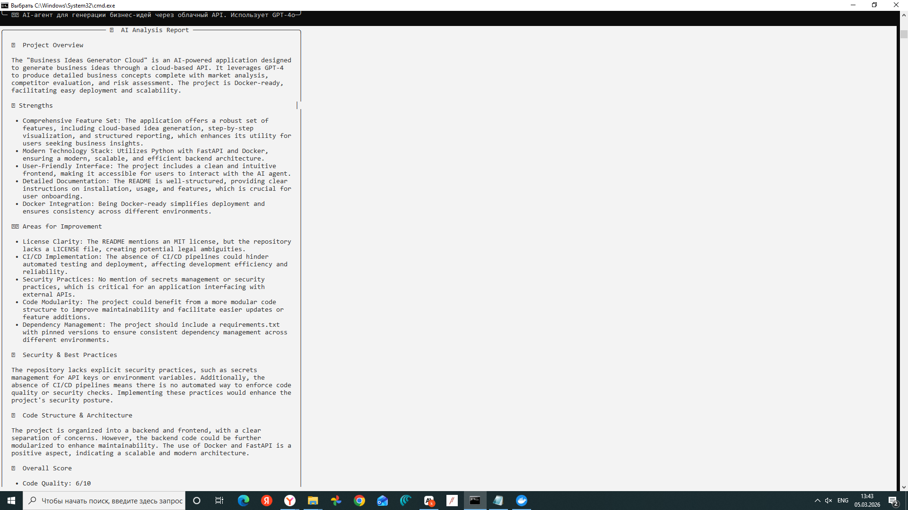
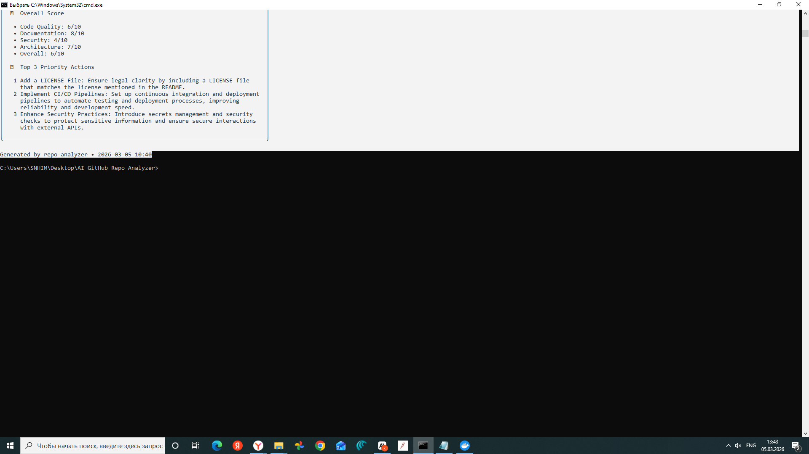

# 🤖 AI GitHub Repo Analyzer

> **Мгновенный AI-анализ любого публичного GitHub-репозитория прямо в терминале.**

Вставь ссылку на репо — получи полный структурированный отчёт на основе GPT-4o за несколько секунд.

---

## ✨ Что делает

- 📦 Получает метаданные репозитория, структуру файлов, README и коммиты через **GitHub API**
- 🧠 Отправляет всё это в **GPT-4o** для глубокого анализа
- 📊 Выводит красивый **отчёт с оценками**: сильные стороны, проблемы, приоритетные действия
- 🐳 Работает через **Docker** — не нужно устанавливать Python

---

## 📸 Пример вывода




---

## 🚀 Быстрый старт

### Вариант 1: Docker (рекомендуется)

```bash
# Сборка
git clone https://github.com/KirillTomenko/repo-analyzer.git
cd repo-analyzer
docker build -t repo-analyzer .

# Запуск
docker run -e OPENAI_API_KEY=ваш_ключ repo-analyzer https://github.com/user/repo
```

### Вариант 2: Python

```bash
git clone https://github.com/KirillTomenko/repo-analyzer.git
cd repo-analyzer
pip install -r requirements.txt

export OPENAI_API_KEY=ваш_ключ        # Mac/Linux
set OPENAI_API_KEY=ваш_ключ           # Windows

python main.py https://github.com/user/repo
```

---

## 📋 Структура отчёта

| Раздел | Описание |
|---|---|
| 🎯 Обзор проекта | Что делает проект и для чего |
| ✅ Сильные стороны | Что реализовано хорошо |
| ⚠️ Что улучшить | Конкретные, применимые замечания |
| 🔒 Безопасность | Секреты, зависимости, уязвимости |
| 📁 Архитектура | Организация кода и поддерживаемость |
| 📊 Оценки | Качество кода, документация, безопасность, архитектура (по 10-балльной шкале) |
| 🚀 Приоритетные действия | Топ-3 вещи, которые стоит сделать прямо сейчас |

---

## 🛠 Стек технологий

| Инструмент | Назначение |
|---|---|
| Python 3.11 | Основной язык |
| GPT-4o (OpenAI) | Движок AI-анализа |
| GitHub REST API | Получение данных репозитория |
| Rich | Красивый вывод в терминале |
| Docker | Контейнеризация |

---

## 🗂 Структура проекта

```
repo-analyzer/
├── main.py           # Точка входа, разбор аргументов CLI
├── analyzer.py       # Логика: GitHub API + GPT-4o анализ
├── Dockerfile        # Описание контейнера
├── requirements.txt  # Зависимости Python
├── .env.example      # Шаблон переменных окружения
└── .gitignore
```

---

## 🔒 Безопасность

`OPENAI_API_KEY` передаётся как переменная окружения при запуске — он **никогда** не хранится в образе или коде.

```bash
# ✅ Безопасно — ключ существует только во время этого запуска
docker run -e OPENAI_API_KEY=sk-... repo-analyzer https://github.com/...
```

---

## 👤 Автор

**Kirill Tomenko** · [GitHub](https://github.com/KirillTomenko) · [Telegram](https://t.me/Kirill_BT)

> Часть моего портфолио AI-инструментов — создаю практичных AI-агентов на Python и Docker.

---

## 📄 Лицензия

MIT — можно свободно использовать, изменять и распространять.
